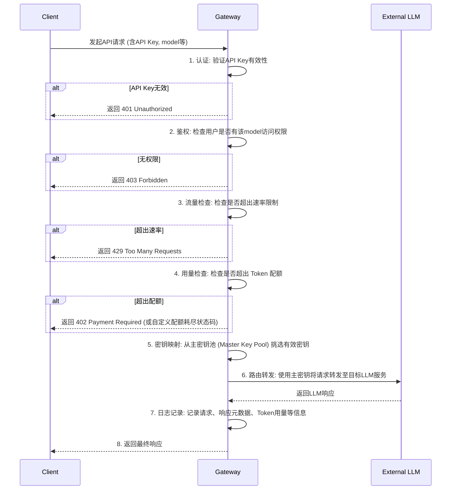
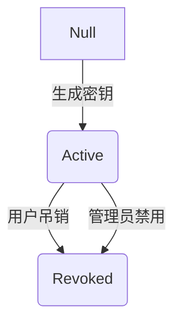

# PRD: LLM 企业 Gateway

## 1. 综述

### 1.1 项目背景

随着大型语言模型（LLM）在企业内部应用日益广泛，不同团队可能独立接入并使用多种外部LLM服务（如OpenAI, Anthropic, Google Gemini等）。这种分散的管理模式导致了若干问题：缺乏统一的成本控制、难以进行安全审计与权限管理、数据与使用情况分散无法形成统一洞察、以及增加了开发人员在不同模型间切换的复杂性。为了解决这些挑战，我们需要构建一个LLM企业Gateway，作为企业访问外部LLM服务的统一入口。

### 1.2 目标与价值

此项目旨在为企业提供一个集中、安全、可控且高效的LLM服务访问层。

- **核心目标**: 平台统一管理外部模型接入，实现 OpenAI 标准协议全兼容，为企业员工提供子账户来访问LLM API，并实现权限管控、流量控制、数据监控和分析。
- **业务价值**:
  - **即插即用**: 兼容 OpenAI API 标准，支持在市面上绝大多数 AI 工具（如 Chatbox, NextChat 等）中直接配置使用。
  - **降本增效**: 通过统一的流量与成本监控，优化模型使用策略，降低总体API支出。通过提供统一的API端点，简化开发流程，提高开发效率。
  - **强化安全与合规**: 实现精细化的权限控制和访问审计，确保敏感数据不被滥用，满足企业安全与合规要求。
  - **数据驱动决策**: 集中收集和分析API使用数据，为业务决策、模型选型和预算分配提供数据支持。
  - **提升可管理性**: 将分散的模型供应商和用户集中管理，简化运维，提高系统的整体可控性。

### 1.3 范围

#### 1.3.1 范围内 (In-Scope)

- **统一API接入**: 提供一个统一的API端点，支持代理转发到多个外部LLM供应商。
- **模型管理**: 支持平台管理员添加、配置和管理不同的外部LLM模型。
- **用户与账户管理**: 支持创建和管理企业员工的子账户，使用邮箱和初始密码进行认证。
- **权限与访问控制**: 基于角色的访问控制（RBAC），支持为不同用户或团队分配不同模型的访问权限。
- **流量与成本控制**: 支持设置API请求速率限制（Rate Limiting）和消费配额（Quotas）。
- **监控与分析仪表盘**: 提供可视化的仪表盘，展示API调用次数、Token用量、成本、错误率等关键指标。
- **API密钥管理**: 支持用户为其子账户生成和管理API密钥。

#### 1.3.2 范围外 (Out-of-Scope)

- **模型微调与训练**: 平台不提供模型微调或训练功能。
- **私有化模型部署**: 平台不负责部署和托管企业自研的LLM模型。
- **高级AI安全防护**: 如提示注入攻击（Prompt Injection）、模型输出内容审查等高级AI安全功能不在本次范围。
- **应用层功能**: 平台专注于API管理，不提供具体的业务应用（如智能客服、代码助手等）。

### 1.4 术语与缩写

| 术语/缩写   | 全称                        | 解释                      |
| :------ | :------------------------ | :---------------------- |
| LLM     | Large Language Model      | 大型语言模型，一种先进的人工智能模型。     |
| Gateway | API Gateway               | API网关，作为所有客户端请求的单一入口点。  |
| 子账户     | Sub-account               | 指分配给企业内部员工，用于访问本平台的账户。  |
| RBAC    | Role-Based Access Control | 基于角色的访问控制，一种权限管理模型。     |
| SSO     | Single Sign-On            | 单点登录，允许用户使用一组凭据登录多个应用。  |
| Token   | Token                     | LLM处理文本的基本单位，通常用于计量和计费。 |

## 2. 用户与场景

### 2.1 用户画像

| 用户角色         | 核心诉求                       | 主要职责                                      |
| :----------- | :------------------------- | :---------------------------------------- |
| **平台管理员**    | 追求系统的稳定性、安全性与可控性。          | 负责整个Gateway平台的配置、维护和监控；管理模型供应商、用户体系、团队预算及权限策略。 |
| **开发者/普通员工** | 希望便捷、稳定地在应用或工作流中使用LLM API。 | 作为最终用户，获取API密钥，调用LLM服务，并监控自己的资源消耗情况。     |

### 2.2 核心用户场景

- **场景一**: 平台管理员希望引入一款新的LLM模型，并开放给特定的AI研究团队使用。
- **场景二**: 某业务团队负责人发现团队本月API费用超支，需要限制团队成员的API调用频率以控制成本。
- **场景三**: 一位新入职的开发者需要在他正在开发的应用中集成LLM功能，他需要快速获取一个可用的API密钥和开发文档。

## 3. 功能需求

### 3.1 功能总览

| 模块          | 核心功能点                           | 目标用户         |
| :---------- | :------------------------------ | :----------- |
| **统一模型接入**  | - 添加/配置外部LLM供应商- 统一的API请求路由     | 平台管理员, 开发者   |
| **账户与认证**   | - 子账户创建与管理- 集成企业身份登录           | 平台管理员, 开发者  |
| **权限管控**    | - 基于角色的权限分配- 按用户/团队控制模型访问权限     | 平台管理员 |
| **流量与成本控制** | - API请求速率限制- API消费额度（预算）限制      | 平台管理员 |
| **数据监控分析**  | - 管理员全局监控报表- 开发者个人用量分析 | 平台管理员, 开发者 |
| **API密钥管理** | - 用户自助生成/吊销API密钥                | 开发者     |

### 3.2 功能详述

#### 3.2.1 统一模型接入

平台提供统一的虚拟 API 接入层，实现“虚拟密钥 (Virtual Key) 到主密钥 (Master Key)”的动态映射，并采取**分阶段协议兼容策略**。

##### 第一阶段 (Phase 1: MVP) - OpenAI 协议全兼容
- **核心目标**: 确保 90% 以上的开源/商业 AI 工具（如 Chatbox, NextChat, LobeChat, Cursor）能够通过修改 `Base URL` 直接接入。
- **标准协议模拟**: Gateway 全量模拟 OpenAI V1 接口协议，支持 `/v1/chat/completions`, `/v1/embeddings`, `/v1/models` 等标准路径。
- **模型别名映射**: 支持用户在第三方工具中直接填入平台预设的模型别名（如 `gpt-4-enterprise`），Gateway 负责后台路由至真实供应商。

##### 第二阶段 (Phase 2: 扩展) - 多协议原生支持
- **Google Gemini 兼容**: 提供对 Google AI SDK 协议（如 `/v1beta/models/...`）的兼容，支持原生多模态能力的无损调用。
- **Anthropic 兼容**: 提供对 Claude Messages API 的原生支持，保留 Claude 特有的参数特性（如 `top_k`）。
- **协议自动识别**: Gateway 根据请求路径和 Header 自动识别入站协议类型，并动态转换为后端供应商所需的格式。

##### 核心接入机制
- **虚拟端点**: 开发者面向统一端点（如 `https://gateway.company.com/v1`）进行开发。
- **虚拟密钥管理**: 平台为每个子账户发放独立的虚拟 API Key，该 Key 仅在 Gateway 内部有效。
- **主密钥池 (Master Key Pool)**: 管理员在后台配置供应商（如 OpenAI, Google, Anthropic）的主密钥，由 Gateway 统一管理和轮询。
- **动态路由**: Gateway 验证虚拟 Key 后，根据权重、负载及隔离规则从主密钥池挑选有效 Master Key 转发。

#### 3.2.2 子账户与身份认证

平台管理员可以在管理后台创建、禁用和删除子账户。身份验证采用“邮箱 + 初始密码”方案。用户首次登录时，系统应引导其修改密码以确保账户安全。管理员可以批量导入用户数据。针对管理员后台，建议采取更严格的密码复杂度要求。

#### 3.2.3 权限管控

采用RBAC模型，预设“管理员”、“团队负责人”、“普通用户”等角色。管理员可以自定义角色及其权限。权限粒度应支持控制特定用户/团队对特定模型或API端点的访问。

#### 3.2.4 流量与用量控制

- **模型用量分级管理**: 支持将模型标记为“免费 (Free)”或“收费 (Paid)”。目前所有模型仅统计 Token 使用数，不涉及真实货币金额折算。
- **速率限制**: 管理员可以配置全局、按用户、按团队或按模型的API请求速率限制（例如，每分钟请求数）。
- **Token 配额**: 配额按用户维度管理，且每笔配额都带有效期。管理员可以为用户发放或回收带过期时间的 Token 配额；用户可以把自己的剩余 Token 配额转配给其他用户。系统需要支持查看用户当前有效配额，以及查看已过期的配额列表（包含配额值、过期时间、配额来源）。

#### 3.2.5 数据监控与分析

提供一个可视化的仪表盘，实时展示以下关键指标：

- **全局指标**: 总请求数、总Token消耗、活跃用户数。
- **细分指标**: 可按用户、团队、模型、时间范围进行筛选和下钻，查看详细的用量分布。
- **错误监控**: 展示API请求的错误率、错误类型分布及错误日志。
- **导出功能**: 支持将统计数据导出为 CSV 文件。目前暂不设置导出规模限制，后续根据数据量增长进行优化。

### 3.3 规则说明

#### 用量计算逻辑 (Usage Calculation Logic)

| 计费类型 | 计算公式 | 资源扣减 | 适用场景 |
| :--- | :--- | :--- | :--- |
| **收费 (Paid)** | `InputTokens + OutputTokens` | 扣减“用户总 Token 额度” | 外部付费 API |
| **免费 (Free)** | `Cost = 0` | 不扣减额度，但受速率限制 | 内部模型、测试额度 |

- **Token 精度**: 所有用量均按整数 Token 计算。
- **配额有效期**: 所有配额都必须带明确的过期时间，到期后自动失效，不再参与消费和转配。
- **配额转配**: 用户只能转出自己的剩余配额，转配成功后转出方立即扣减、转入方立即生效；转入配额继承原始配额的过期时间，不能通过转配延长有效期。
- **重试策略**: 仅支持针对当前供应商的重试，**不允许**跨供应商或跨模型回退。

#### API请求处理流程 (序列图)

### 3.4 用户故事与验收标准

| ID         | 用户故事                                                           | 验收标准 (AC)                                                                                                                                                                         |
| :--------- | :------------------------------------------------------------- | :-------------------------------------------------------------------------------------------------------------------------------------------------------------------------------- |
| **US-001** | 作为一名**平台管理员**，我想要在后台添加并配置一个新的LLM供应商，以便让公司的开发者能使用最新的模型。         | AC-001.1: 管理后台提供一个表单，用于输入供应商名称、API基础URL和认证凭证（如API Key）。AC-001.2: 提交后，新的供应商会出现在可用供应商列表中。AC-001.3: 系统的认证凭证必须加密存储。                                                                   |
| **US-002** | 作为一名**平台管理员**，我想要创建一个新的用户账户并将其分配给一个团队，以便进行管理。                | AC-002.1: 管理后台可以手动创建用户，并设置其初始密码、所属团队和角色。AC-002.2: 用户首次登录需要强制修改密码。AC-002.3: 身份认证采用邮箱+密码方案。                                                                        |
| **US-003** | 作为一名**平台管理员**，我想要为一个“初级开发者”角色设置权限，使其只能访问公司购买的成本较低的特定模型。        | AC-003.1: 权限配置页面允许创建/编辑角色。AC-003.2: 角色配置中可以勾选允许访问的模型列表。AC-003.3: 分配了该角色的用户在调用被禁止的模型时，会收到403 Forbidden错误。                                                                          |
| **US-004** | 作为一名**平台管理员**，我想要管理每个用户的带有效期 Token 配额，并允许用户之间转配剩余额度，以便更灵活地分配企业资源。             | AC-004.1: 管理后台支持按用户查看当前有效配额，并为用户新增或回收带过期时间的配额。AC-004.2: 系统支持查看用户已过期的配额列表，列表至少包含配额值、过期时间、配额来源。AC-004.3: 用户只能把自己的剩余配额转配给其他有效用户，且转入配额必须继承原始过期时间。AC-004.4: 当用户可用配额不足或配额已过期时，系统必须拒绝新的 API 请求或转配请求，并返回明确错误原因。                                                          |
| **US-005** | 作为一名**平台管理员**，我想要在仪表盘上按团队或用户维度查看详细的API调用统计，以便进行内部核算。    | AC-005.1: 仪表盘提供按团队或用户筛选的功能。AC-005.2: 能够展示特定范围内的用量排名。AC-005.3: 支持将统计数据导出为CSV文件。                                                                                  |
| **US-006** | 作为一名**开发者**，我想要在我的个人设置页面生成一个API密钥，以便在我的应用程序中调用Gateway API。     | AC-006.1: 用户登录后，在“API密钥”管理页面可以点击“生成新密钥”按钮。AC-006.2: 系统生成一个唯一的API密钥，并仅显示一次。AC-006.3: 页面提供“复制”按钮。                                                              |
| **US-007** | 作为一名**开发者**，我怀疑我的一个API密钥已经泄露，我想要立即将其作废。                        | AC-007.1: 在“API密钥”管理页面，我可以看到我所有有效的密钥列表。AC-007.2: 每个密钥旁边都有一个“吊销”按钮。AC-007.3: 吊销后该密钥立即失效。                                                          |
| **US-008** | 作为一名**平台管理员**，我需要一个全局监控仪表盘，以便快速了解整个平台的健康状况和资源消耗。               | AC-008.1: 首页展示过去24小时的总请求数、错误率、平均延迟和总 Token 消耗。AC-008.2: 展示当前活跃用户和热门模型排名。AC-008.3: 页面数据每分钟自动刷新。                                                                           |
| **US-009** | 作为一名**开发者**，当我的API请求因为超出速率限制而被拒绝时，我希望收到的错误响应中能明确告知我原因。 | AC-009.1: 当请求被限流时，API应返回 `429 Too Many Requests`。AC-009.2: 响应头包含 `Retry-After` 字段。AC-009.3: 响应体包含错误信息。                    |
| **US-010** | 作为一名**开发者**，我想要查看我个人的API使用次数和产生的 Token 消耗，以便了解我的资源消耗。 | AC-010.1: 开发者个人中心提供一个简易的仪表盘。AC-010.2: 展示该开发者本月至今的请求次数和 Token 消耗。AC-010.3: 支持按模型查看消耗分布。 |
| **US-011** | 作为一名**开发者**，我想要在第三方 AI 工具（如 Chatbox）中使用 Gateway 提供的服务，以便利用我熟悉的工具进行工作。 | AC-011.1: Gateway 接口必须完全兼容 OpenAI API 规范。AC-011.2: 开发者只需在第三方工具中配置 Gateway 的自定义 Base URL 和虚拟 Key 即可正常使用。AC-011.3: 个人中心应提供常见工具的配置指南文档。 |
| **US-012** | 作为一名**平台管理员**，我想要配置不同模型的计费类型或将其设为免费，以便灵活管理资源消耗。 | AC-012.1: 模型管理页面支持选择计费类型（免费/收费）。AC-012.2: 针对收费模型，目前仅做用量统计，不设置具体单价。AC-012.3: 免费模型支持配置每月 Token 赠送额度。 |

### 3.5 数据结构定义

此部分定义了系统的核心业务实体及其关键属性。

- **User (用户)**
  - `user_id` (Primary Key): 唯一标识符
  - `username`: 用户名
  - `email`: 邮箱
  - `role_id` (Foreign Key): 关联的角色
  - `team_id` (Foreign Key): 所属的团队
  - `status`: (e.g., `Active`, `Disabled`)
- **Team (团队)**
  - `team_id` (Primary Key): 唯一标识符
  - `team_name`: 团队名称
  - `team_lead_id` (Foreign Key to User): 团队负责人
- **Role (角色)**
  - `role_id` (Primary Key): 唯一标识符
  - `role_name`: 角色名称 (e.g., Admin, Developer)
  - `permissions`: 权限定义 (e.g., `{"allow_models": ["gpt-4", "claude-3-opus"], "can_view_dashboard": true}`)
- **ApiKey (虚拟 API 密钥)**
  - `key_id` (Primary Key): 唯一标识符
  - `key_hash`: 虚拟密钥的哈希值
  - `user_id` (Foreign Key): 所属用户
  - `status`: (e.g., `Active`, `Revoked`)
  - `created_at`: 创建时间
- **UserQuotaAccount (用户配额账户)**
  - `user_id` (Primary Key / Foreign Key): 配额所属用户
  - `current_quota_tokens`: 当前仍在有效期内的总配额
  - `used_tokens`: 当前已消耗 Token
  - `expired_tokens`: 当前已过期 Token 累计
  - `available_tokens`: 当前可消费、可转配的剩余 Token
  - `allow_transfer_out`: 是否允许转出额度
  - `earliest_expire_at`: 当前有效配额中的最早过期时间
- **UserQuotaGrant (用户配额批次)**
  - `grant_id` (Primary Key): 配额批次唯一标识
  - `user_id` (Foreign Key): 配额所属用户
  - `source_type`: 配额来源 (e.g., `ADMIN_GRANT`, `TRANSFER_IN`, `COMPENSATE`)
  - `source_user_id`: 来源用户
  - `granted_tokens`: 发放额度
  - `remaining_tokens`: 当前剩余额度
  - `expires_at`: 过期时间
  - `status`: 批次状态 (e.g., `ACTIVE`, `DEPLETED`, `EXPIRED`)
- **UserQuotaTransaction (用户配额流水)**
  - `transaction_id` (Primary Key): 流水唯一标识
  - `user_id` (Foreign Key): 额度归属用户
  - `change_type`: 变更类型 (e.g., `ADMIN_GRANT`, `ADMIN_RECLAIM`, `TRANSFER_OUT`, `TRANSFER_IN`, `QUOTA_EXPIRE`, `USAGE_SETTLE`)
  - `delta_tokens`: 本次变更额度
  - `counterparty_user_id`: 转配对手方用户
  - `operator_user_id`: 操作人
  - `created_at`: 创建时间
- **ModelProvider (模型供应商)**
  - `provider_id` (Primary Key): 唯一标识符
  - `provider_name`: 供应商名称 (e.g., OpenAI, Anthropic)
  - `api_base_url`: 供应商基础 URL
  - `billing_type`: 计费类型 (Free, Paid)
  - `routing_strategy`: 路由策略 (e.g., `RoundRobin`, `Weighted`)
- **ProviderKey (主密钥池)**
  - `master_key_id` (Primary Key): 唯一标识符
  - `provider_id` (Foreign Key): 关联供应商
  - `encrypted_key`: 加密后的供应商 API Key
  - `status`: (e.g., `Healthy`, `RateLimited`, `Invalid`)
  - `weight`: 路由权重 (用于非 RoundRobin 策略)
  - `team_id` (Optional): 针对特定团队分配的独立主密钥 (实现隔离)
- **UsageLog (用量日志)**
  - `log_id` (Primary Key): 日志ID
  - `request_id`: 单次请求的唯一ID
  - `user_id`: 用户ID
  - `api_key_id`: 使用的API密钥ID
  - `model_name`: 请求的模型名称
  - `prompt_tokens`: 输入的Token数
  - `completion_tokens`: 输出的Token数
  - `total_tokens`: 总Token数
  - `latency_ms`: 请求耗时（毫秒）
  - `status_code`: HTTP响应状态码
  - `timestamp`: 请求时间戳

### 3.6 状态与行为定义

此部分定义了关键对象的状态流转。

#### APIKey 状态机

- **Active**: 密钥有效，可用于API调用。
- **Revoked**: 密钥已被吊销，永久失效，无法恢复。

### 3.7 边界条件与异常场景

| 场景                   | 系统应如何响应                                                                                         |
| :------------------- | :---------------------------------------------------------------------------------------------- |
| **外部LLM服务超时或不可用**    | Gateway应在设定的超时时间（如30秒）后中断连接，并向客户端返回 `504 Gateway Timeout` 错误。同时，系统应记录该次失败，并在监控仪表盘上体现第三方服务的健康状况。 |
| **外部LLM服务返回错误**      | Gateway应将外部服务返回的错误码和错误信息透传给客户端，同时记录错误日志。例如，OpenAI返回内容安全错误，Gateway也应返回相应的错误信息。                   |
| **请求速率/配额在流式响应中途耗尽** | 对于流式（Streaming）API调用，如果在响应中途用户的配额耗尽，系统应立即中断流式传输，并向客户端发送一个特殊的结束标记或自定义状态码（如 `402` 或自定义 JSON 错误块），指明中断原因。                        |
| **并发请求下的配额竞争**       | 系统必须采用原子操作（如使用Redis的INCR或数据库事务）来更新用量和配额，确保在高并发场景下计数的准确性，避免超额使用。                                 |
| **配额到达过期时间**       | 系统必须自动将过期配额从当前可用额度中移除，并在过期列表中保留该记录的配额值、过期时间和来源信息，供后台和用户查询。                                 |
| **用户转配额度时余额不足**       | 系统必须在提交转配前校验转出方剩余额度，并在单事务中同时扣减转出方和增加转入方；若任一步骤失败，则整笔转配回滚。                                 |
| **用户给自己或无效用户转配**       | 系统应拒绝该操作，返回明确错误提示，不产生任何额度流水或账户变化。                                 |
| **转配后试图延长配额有效期**       | 系统必须保留原始配额的过期时间，禁止通过转配将即将过期的配额重新变成长效配额。                                 |
| **免费模型 Token 额度耗尽** | 虽然模型免费，但若用户可用的“免费 Token 额度”耗尽，Gateway 应返回 `429 Too Many Requests` 或自定义错误码。 |
| **无效的API密钥**         | 请求应立即被拒绝，返回 `401 Unauthorized` 错误，且不进行后续的权限或配额检查，以减少不必要的系统负载。                                   |
| **用户无权访问指定模型**       | 请求应被拒绝，返回 `403 Forbidden` 错误，并清晰地在响应体中说明是模型访问权限不足。                                              |

## 4. 非功能需求

### 4.1 性能

- **网关延迟**: Gateway自身处理（认证、鉴权、路由、日志记录）引入的额外延迟应低于50ms。
- **吞吐量**: 系统初始版本应支持至少每秒500次并发请求（500 QPS）。
- **仪表盘加载**: 监控仪表盘页面加载时间应在3秒以内。

### 4.2 可用性

- **系统可用性**: 核心API网关服务的可用性目标为99.95%。
- **故障恢复**: 系统应具备高可用性设计，单个节点故障不应影响整体服务。

### 4.3 安全性

- **凭证安全**: 所有外部LLM供应商的API Key以及本平台用户的API Key必须加密存储在安全的密钥管理系统（如Vault）中。
- **身份认证**: 强制所有访问管理后台和用户页面的请求进行身份认证。一期采用“邮箱 + 密码”方案，后续可考虑集成企业 SSO。
- **传输安全**: 所有网络通信必须使用TLS/SSL加密。
- **访问控制**: 严格执行RBAC，确保用户只能访问其被授权收到的资源和数据。

### 4.4 可扩展性

- **架构扩展**: 系统采用微服务架构，核心网关、鉴权中心、计费引擎及监控中心均支持水平扩展。
- **协议路由与转换引擎 (Protocol Transpiler)**: 设计独立的协议适配层，支持通过插件化方式快速新增对各种 LLM 原生协议（如 Gemini, Claude）的入站兼容。
- **供应商插件化**: 外部供应商（如 OpenAI, Google AI, Azure）的接入采用统一接口封装，新增供应商仅需实现相应的适配器，无需修改核心路由逻辑。
- **多级 Key 池管理**: 支持针对不同团队或业务场景，灵活扩展独立的主密钥池，满足精细化的资源隔离需求。

## 5. 修订记录

| 版本   | 修订日期        | 修订内容                                      | 修订人    |
| :--- | :---------- | :---------------------------------------- | :----- |
| V1.0 | 2026年03月23日 | 初始版本创建                                    | Gemini |
| V1.1 | 2026年03月23日 | 明确“主密钥池 + 虚拟密钥映射”架构，更新 3.2.1、3.3 及 3.5 章节 | Gemini |
| V1.2 | 2026年03月25日 | 简化用户角色（移除业务负责人），移除 SSO 需求，新增开发者用量查看故事 | Gemini |
| V1.3 | 2026年03月25日 | 强化 OpenAI 协议全兼容，支持第三方工具即插即用，新增 US-011 | Gemini |
| V1.4 | 2026年03月25日 | 明确分阶段协议适配策略（Phase 1: OpenAI MVP, Phase 2: 多协议原生支持），更新 3.2.1 及 4.4 章节 | Gemini |
| V1.5 | 2026年03月27日 | 新增模型计费类型（免费/收费）逻辑，支持按 1k Tokens 配置单价，更新 3.2.4、3.3、3.4、3.5 及 3.7 章节 | Gemini |
| V1.6 | 2026年04月08日 | 1. 移除 SSO 需求，采用邮箱+密码认证方案 2. 性能目标调整为 500 QPS 3. 计费逻辑调整为仅统计 Token 用量，不涉及货币换算 4. 增加流式配额耗尽自定义状态码，明确不支持跨供应商回退 | Gemini |
| V1.7 | 2026年05月21日 | 1. 将 US-004 从团队配额改为用户配额管理 2. 新增用户之间剩余额度转配能力 3. 补充用户配额账户与额度流水的数据结构定义 | GPT-5.4 |
| V1.8 | 2026年05月21日 | 1. 移除用户配额周期类型概念，改为所有配额均带有效期 2. 新增当前配额与已过期配额列表查看能力 3. 明确转入配额继承原始过期时间 | GPT-5.4 |
