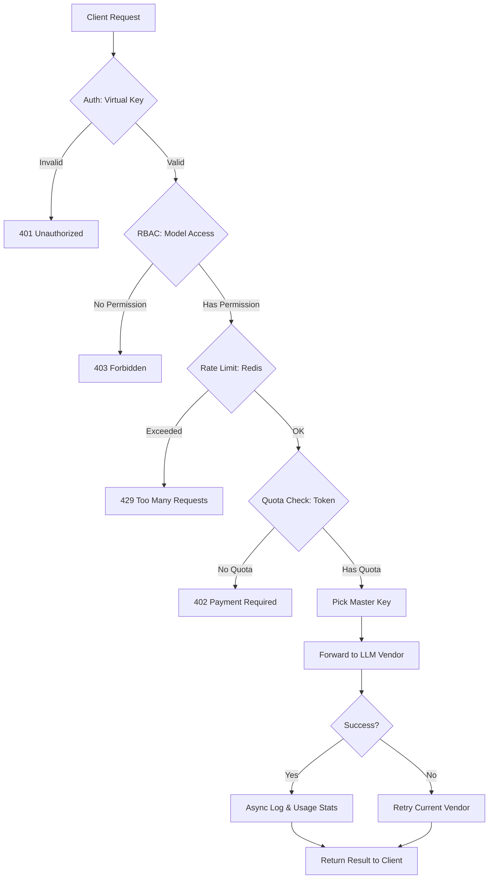
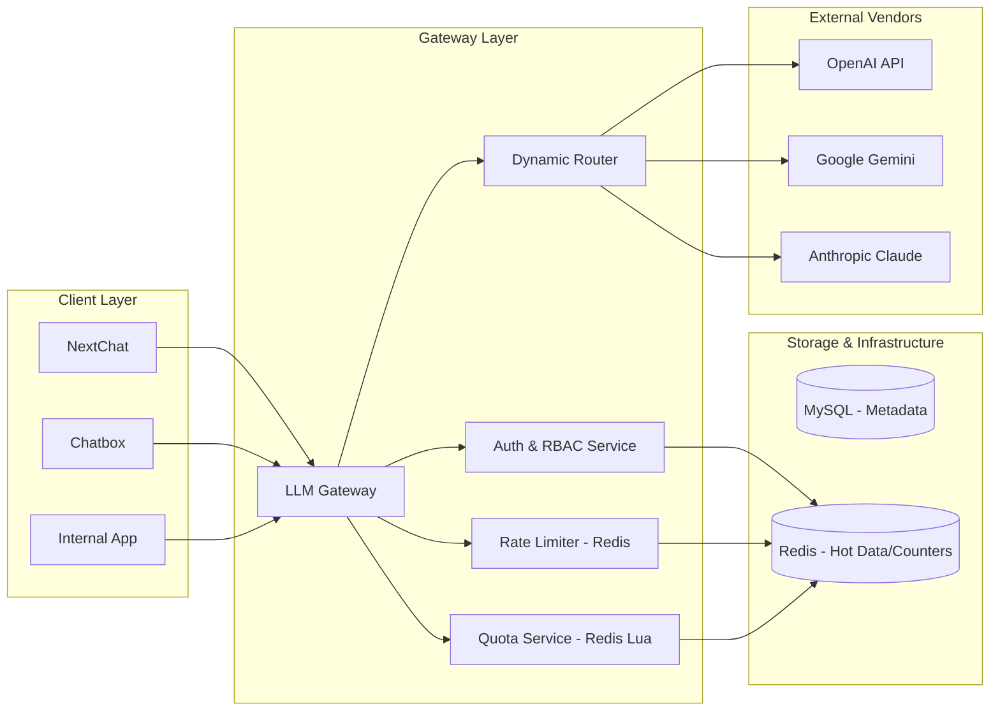
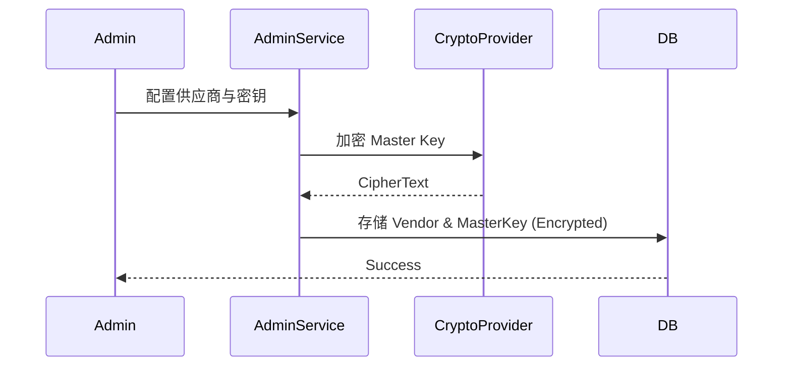
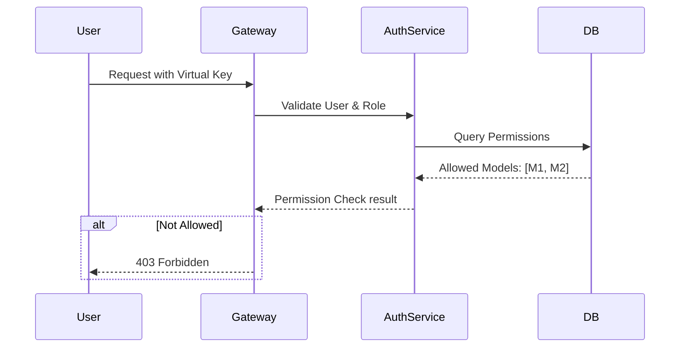

# 技术方案：LLM 企业 Gateway

## 1、概述

### 1.1 项目背景
随着企业内部 LLM 应用的激增，分散的模型接入导致了成本失控、安全审计缺失以及开发复杂度增加。本项目旨在构建一个统一的 LLM Gateway，作为企业访问外部模型（OpenAI, Google, Anthropic 等）的唯一入口。

### 1.2 目标
- **OpenAI 协议兼容**：支持主流 AI 工具（Chatbox, NextChat 等）零成本迁移。
- **高性能转发**：承载十万至百万级日均请求，毫秒级响应延迟。
- **精细化管控**：实现基于 RBAC 的权限控制、Token 配额（Quotas）及速率限制（Rate Limiting）。
- **统一监控**：全局 Token 消耗统计、错误分析及多维度报表。

### 1.3 范围与约束
- **范围内**：虚拟 Key 映射、主密钥池管理、RBAC 权限、Token 配额统计、OpenAI 协议模拟。
- **范围外**：模型微调、内容审查、高级安全防护（如 Prompt Injection 拦截）。
- **核心约束**：必须基于现有 Kotlin + Spring Boot + Redis + MySQL 技术栈。

---

## 2、业务流程分析

### 2.1 业务背景
Gateway 作为中间层，需在转发请求前后完成：身份验证 -> 权限校验 -> 限流检查 -> 配额检查 -> 主密钥匹配 -> 异步统计。

### 2.2 核心业务流程图


---

## 3、领域模型

### 3.1 核心概念
- **User (用户)**：企业员工，拥有虚拟账号。
- **Department (部门)**：组织结构单元，用户归属部门，Token 配额在部门维度管理。
- **Model (模型)**：对外部模型的抽象（如 `gpt-4-enterprise`），可关联多个 Vendor。
- **Vendor (供应商)**：真实的 LLM 提供商（如 OpenAI, Google AI）。
- **MasterKey (主密钥)**：管理员配置的、真实的 API Key。
- **VirtualKey (虚拟密钥)**：分发给用户的 API Key，格式遵循 `sk-vkey-...`。
- **Quota (配额)**：Token 预算管理（部门维度），支持按月重置。

---

## 4、系统架构

### 4.1 总体架构视图


### 4.2 关键决策
1.  **高性能网关实现**：
    -   **决策**：使用 Spring Boot 默认的 Servlet 容器，但对转发逻辑采用异步非阻塞 HTTP 客户端（如 `WebClient` 或 `Apache HttpAsyncClient`），避免阻塞 Tomcat 工作线程。
    -   **理由**：现有技术栈是 Spring Boot，且转发逻辑主要是 IO 等待，非阻塞客户端能极大提升吞吐。
2.  **Token 统计策略**：
    -   **决策**：**预扣费 + 差额补回**。针对流式输出（Streaming），先根据请求长度预估 Token 并冻结配额，流结束时根据 Vendor 返回的 `usage` 字段（或本地 Tiktoken 计算）修正真实消耗。
    -   **理由**：防止超额使用，同时保证统计精度。

---

## 5、数据设计

### 5.1 核心表结构 (DDL)

```sql
CREATE TABLE `department` (
  `id` bigint NOT NULL AUTO_INCREMENT COMMENT '部门id',
  `parent_id` bigint DEFAULT '0' COMMENT '父部门id',
  `dept_name` varchar(50) NOT NULL COMMENT '部门名称',
  `order_num` int DEFAULT '0' COMMENT '显示顺序',
  `leader_user_id` bigint DEFAULT NULL COMMENT '负责人用户ID',
  `tel` varchar(20) DEFAULT NULL COMMENT '联系电话',
  `status` int DEFAULT '1' COMMENT '部门状态（1正常 2停用）',
  `del_flag` tinyint(1) DEFAULT '0' COMMENT '删除标志（0代表存在 1代表删除）',
  `created_time` datetime DEFAULT NULL COMMENT '创建时间',
  `updated_time` datetime DEFAULT NULL COMMENT '更新时间',
  PRIMARY KEY (`id`)
) ENGINE=InnoDB AUTO_INCREMENT=202 DEFAULT CHARSET=utf8mb4 COLLATE=utf8mb4_0900_ai_ci COMMENT='部门表';

CREATE TABLE `position` (
  `id` bigint NOT NULL AUTO_INCREMENT COMMENT '岗位ID',
  `post_code` varchar(64) NOT NULL COMMENT '岗位编码',
  `post_name` varchar(50) NOT NULL COMMENT '岗位名称',
  `post_sort` int NOT NULL COMMENT '显示顺序',
  `status` int NOT NULL DEFAULT '1' COMMENT '状态（1正常 2停用）',
  `created_by` varchar(64) DEFAULT NULL COMMENT '创建者',
  `updated_by` varchar(64) DEFAULT NULL COMMENT '更新者',
  `created_time` datetime DEFAULT CURRENT_TIMESTAMP COMMENT '创建时间',
  `updated_time` datetime DEFAULT CURRENT_TIMESTAMP ON UPDATE CURRENT_TIMESTAMP COMMENT '更新时间',
  PRIMARY KEY (`id`)
) COMMENT='岗位信息表';

CREATE TABLE `roles` (
  `id` bigint NOT NULL AUTO_INCREMENT COMMENT '角色ID',
  `role_name` varchar(30) NOT NULL COMMENT '角色名称',
  `role_key` varchar(100) NOT NULL COMMENT '角色权限字符串',
  `role_sort` int NOT NULL COMMENT '显示顺序',
  `created_by` varchar(64) DEFAULT '' COMMENT '创建者',
  `created_time` datetime DEFAULT CURRENT_TIMESTAMP COMMENT '创建时间',
  `updated_by` varchar(64) DEFAULT '' COMMENT '更新者',
  `updated_time` datetime DEFAULT CURRENT_TIMESTAMP ON UPDATE CURRENT_TIMESTAMP COMMENT '更新时间',
  PRIMARY KEY (`id`)
) COMMENT='角色信息表';

CREATE TABLE `users` (
  `id` bigint NOT NULL AUTO_INCREMENT,
  `dept_id` bigint NOT NULL COMMENT '部门ID',
  `username` varchar(64) NOT NULL COMMENT '用户账号',
  `email` varchar(128) NOT NULL COMMENT '用户邮箱',
  `mobile` varchar(11) DEFAULT NULL COMMENT '手机号码',
  `gender` int DEFAULT '3' COMMENT '用户性别（1男 2女 3未知）',
  `avatar_url` varchar(200) DEFAULT NULL COMMENT '头像地址',
  `password` varchar(255) NOT NULL COMMENT '密码',
  `password_changed` tinyint(1) DEFAULT '0' COMMENT '强制首登改密',
  `remark` varchar(500) DEFAULT NULL COMMENT '备注',
  `status` int DEFAULT '1' COMMENT '状态1-正常，2-离职',
  `del_flag` tinyint(1) DEFAULT '0' COMMENT '状态0-正常，1-已删除',
  `created_time` timestamp NULL DEFAULT CURRENT_TIMESTAMP,
  `updated_time` timestamp NULL DEFAULT CURRENT_TIMESTAMP,
  PRIMARY KEY (`id`),
  UNIQUE KEY `username` (`username`),
  UNIQUE KEY `email` (`email`)
) ENGINE=InnoDB AUTO_INCREMENT=100 COMMENT='用户信息表';

CREATE TABLE `user_post_rel` (
  `user_id` bigint NOT NULL COMMENT '用户ID',
  `post_id` bigint NOT NULL COMMENT '岗位ID',
  PRIMARY KEY (`user_id`,`post_id`)
) COMMENT='用户与岗位关联表';

CREATE TABLE `user_role_rel` (
  `user_id` bigint NOT NULL COMMENT '用户ID',
  `role_id` bigint NOT NULL COMMENT '角色ID',
  PRIMARY KEY (`user_id`,`role_id`)
) COMMENT='用户和角色关联表';

CREATE TABLE `vendors` (
  `id` BIGINT PRIMARY KEY AUTO_INCREMENT,
  `name` VARCHAR(64) NOT NULL COMMENT '供应商名称',
  `base_url` VARCHAR(255) NOT NULL COMMENT '供应商URL',
  `status` INT DEFAULT 1 COMMENT '1-正常，2-停用',
  `created_time` TIMESTAMP DEFAULT CURRENT_TIMESTAMP COMMENT '创建时间',
  `updated_time` TIMESTAMP DEFAULT CURRENT_TIMESTAMP ON UPDATE CURRENT_TIMESTAMP COMMENT '更新时间'
) COMMENT='供应商表';

-- 主密钥池表
CREATE TABLE `master_keys` (
  `id` bigint NOT NULL AUTO_INCREMENT,
  `vendor_id` bigint NOT NULL COMMENT '供应商ID',
  `api_key_encrypted` text NOT NULL COMMENT 'AES 加密存储',
  `weight` int DEFAULT '10' COMMENT '负载均衡权重',
  `status` int DEFAULT '1' COMMENT '1-正常,2-异常',
  `error_count` int DEFAULT '0' COMMENT '连续失败次数',
  `last_checked_at` timestamp NULL DEFAULT NULL,
  `created_time` datetime DEFAULT CURRENT_TIMESTAMP,
  `updated_time` datetime DEFAULT CURRENT_TIMESTAMP ON UPDATE CURRENT_TIMESTAMP,
  PRIMARY KEY (`id`),
  KEY `index_vendor_id` (`vendor_id`) USING BTREE
) COMMENT='主密钥池表';

-- 模型定义表
CREATE TABLE `models` (
  `id` bigint NOT NULL AUTO_INCREMENT,
  `model_alias` varchar(64) NOT NULL COMMENT '别名，如 gpt-4-enterprise',
  `real_model_name` varchar(64) NOT NULL COMMENT '供应商模型名，如 gpt-4o',
  `vendor_id` bigint NOT NULL COMMENT '供应商ID',
  `billing_type` enum('FREE','PAID') DEFAULT 'PAID',
  `active` tinyint(1) DEFAULT '1' COMMENT '是否活跃',
  `created_time` datetime DEFAULT CURRENT_TIMESTAMP,
  `updated_time` datetime DEFAULT CURRENT_TIMESTAMP ON UPDATE CURRENT_TIMESTAMP,
  PRIMARY KEY (`id`),
  UNIQUE KEY `model_alias` (`model_alias`)
) COMMENT='模型定义表';

-- 部门-模型权限表（US-003）
CREATE TABLE `department_model_permissions` (
  `id` BIGINT NOT NULL AUTO_INCREMENT,
  `dept_id` BIGINT NOT NULL COMMENT '部门ID',
  `model_id` BIGINT NOT NULL COMMENT '模型ID',
  `scope` ENUM('SELF', 'SUBTREE') NOT NULL DEFAULT 'SUBTREE' COMMENT '权限作用域：仅本部门/含子树',
  `status` INT NOT NULL DEFAULT 1 COMMENT '1-生效，0-禁用',
  `created_by` VARCHAR(64) DEFAULT NULL COMMENT '创建者',
  `created_time` DATETIME DEFAULT CURRENT_TIMESTAMP COMMENT '创建时间',
  `updated_by` VARCHAR(64) DEFAULT NULL COMMENT '更新者',
  `updated_time` DATETIME DEFAULT CURRENT_TIMESTAMP ON UPDATE CURRENT_TIMESTAMP COMMENT '更新时间',
  PRIMARY KEY (`id`),
  UNIQUE KEY `uk_dept_model_scope` (`dept_id`, `model_id`, `scope`),
  KEY `idx_dept_status` (`dept_id`, `status`),
  KEY `idx_model_status` (`model_id`, `status`)
) COMMENT='部门模型访问权限表';

-- 虚拟 API Key 表
CREATE TABLE `api_keys` (
  `id` BIGINT PRIMARY KEY AUTO_INCREMENT,
  `user_id` BIGINT NOT NULL,
  `api_key_hash` VARCHAR(128) UNIQUE NOT NULL,
  `api_key_prefix` VARCHAR(16) NOT NULL COMMENT '展示用前缀',
  `status` TINYINT DEFAULT 1,
  `expires_at` TIMESTAMP NULL
);

-- 部门 Token 配额表
CREATE TABLE `department_quotas` (
  `id` BIGINT PRIMARY KEY AUTO_INCREMENT,
  `dept_id` BIGINT NOT NULL COMMENT '部门ID',
  `total_tokens` BIGINT NOT NULL COMMENT '周期内总额度',
  `used_tokens` BIGINT NOT NULL DEFAULT 0 COMMENT '周期内已使用',
  `period` ENUM('MONTHLY', 'FOREVER') NOT NULL DEFAULT 'MONTHLY' COMMENT 'MONTHLY-月维度，FOREVER-永久有效',
  `last_reset_at` DATETIME DEFAULT NULL COMMENT '上次重置时间（MONTHLY时使用）',
  `created_at` DATETIME NOT NULL DEFAULT CURRENT_TIMESTAMP,
  `updated_at` DATETIME NOT NULL DEFAULT CURRENT_TIMESTAMP ON UPDATE CURRENT_TIMESTAMP(3),
  UNIQUE KEY `uk_dept_id` (`dept_id`),
  KEY `idx_period_reset` (`period`, `last_reset_at`)
) COMMENT='部门维度Token配额';

-- 用量记录日志表
CREATE TABLE `usage_logs` (
  `id` BIGINT NOT NULL AUTO_INCREMENT,
  `request_id` VARCHAR(64) NOT NULL COMMENT '幂等/链路ID',
  `user_id` BIGINT NOT NULL COMMENT '调用用户',
  `dept_id` BIGINT NOT NULL COMMENT '冗余：便于按部门聚合（避免实时Join users）',
  `api_key_id` BIGINT DEFAULT NULL COMMENT '虚拟Key ID',
  `vendor_id` BIGINT NOT NULL COMMENT '供应商ID',
  `model_id` BIGINT NOT NULL COMMENT '模型ID',
  `endpoint` VARCHAR(32) NOT NULL COMMENT 'OpenAI路径语义，如 chat.completions/embeddings',
  `is_stream` TINYINT(1) NOT NULL DEFAULT 0 COMMENT '是否流式',
  `prompt_tokens` INT NOT NULL DEFAULT 0,
  `completion_tokens` INT NOT NULL DEFAULT 0,
  `total_tokens` INT NOT NULL DEFAULT 0,
  `latency_ms` INT DEFAULT NULL COMMENT '网关侧端到端耗时',
  `status_code` INT NOT NULL COMMENT 'HTTP状态码',
  `error_code` VARCHAR(64) DEFAULT NULL COMMENT '业务错误码（如 RBAC_MODEL_FORBIDDEN）',
  `created_at` DATETIME(3) NOT NULL DEFAULT CURRENT_TIMESTAMP(3),
  PRIMARY KEY (`id`),
  UNIQUE KEY `uk_request_id` (`request_id`),
  KEY `idx_user_time_id` (`user_id`, `created_at`, `id`),
  KEY `idx_dept_time_id` (`dept_id`, `created_at`, `id`),
  KEY `idx_vendor_model_time` (`vendor_id`, `model_id`, `created_at`),
  KEY `idx_status_time` (`status_code`, `created_at`)
) COMMENT='LLM调用用量明细（事实表）';

-- 部门维度日聚合（仪表盘主查询表）
CREATE TABLE `usage_stats_daily_department` (
  `stat_date` DATE NOT NULL,
  `dept_id` BIGINT NOT NULL,
  `total_tokens` BIGINT NOT NULL DEFAULT 0,
  `request_cnt` BIGINT NOT NULL DEFAULT 0,
  `error_cnt` BIGINT NOT NULL DEFAULT 0,
  `active_users` INT NOT NULL DEFAULT 0,
  `updated_at` DATETIME(3) NOT NULL DEFAULT CURRENT_TIMESTAMP(3) ON UPDATE CURRENT_TIMESTAMP(3),
  PRIMARY KEY (`stat_date`, `dept_id`),
  KEY `idx_dept_date` (`dept_id`, `stat_date`)
) COMMENT='部门维度日聚合';

-- 用户维度日聚合（个人视角报表）
CREATE TABLE `usage_stats_daily_user` (
  `stat_date` DATE NOT NULL,
  `user_id` BIGINT NOT NULL,
  `dept_id` BIGINT NOT NULL,
  `total_tokens` BIGINT NOT NULL DEFAULT 0,
  `request_cnt` BIGINT NOT NULL DEFAULT 0,
  `error_cnt` BIGINT NOT NULL DEFAULT 0,
  `updated_at` DATETIME(3) NOT NULL DEFAULT CURRENT_TIMESTAMP(3) ON UPDATE CURRENT_TIMESTAMP(3),
  PRIMARY KEY (`stat_date`, `user_id`),
  KEY `idx_dept_user_date` (`dept_id`, `user_id`, `stat_date`)
) COMMENT='用户维度日聚合';
```

### 5.2 索引建议
-   `api_keys(api_key_hash)`: 唯一索引，用于快速身份验证。
-   `department_quotas(dept_id)`: 唯一索引，用于部门配额检查。
-   `department_model_permissions(dept_id, status)`: 部门授权模型查询高频索引。
-   `department_model_permissions(model_id, status)`: 模型维度反查被授权部门索引。
-   `usage_logs(dept_id, created_at, id)`: 部门维度明细导出/增量聚合的主索引（范围扫描 + 游标分页）。
-   `usage_logs(user_id, created_at, id)`: 个人维度明细导出索引。
-   `usage_stats_daily_department(stat_date, dept_id)`: 仪表盘趋势查询主键（天然覆盖）。
-   `usage_stats_daily_user(stat_date, user_id)`: 个人趋势查询主键（天然覆盖）。

---

## 6、详细设计

### 6.1 故事 1：供应商与模型管理 (US-001, US-012)
- **设计**：提供管理后台接口，支持配置外部供应商（如 OpenAI）、主密钥池以及模型别名映射。
- **数据模型**：`vendors`, `master_keys`, `models`
- **接口**：
  - `POST /admin/vendors`：添加供应商及其 Base URL。
  - `POST /admin/master-keys`：向密钥池添加加密存储的 API Key。
  - `POST /admin/models`：配置模型别名（如 `gpt-4-enterprise`）与真实模型名的映射。
- **关键逻辑**：
  - **密钥加密**：应用启动时生成/加载本地 AES Key，存储时对 `api_key` 加密，转发前解密。
  - **权重负载均衡**：从 `master_keys` 中根据 `weight` 字段使用加权轮询算法选择 Key。
- **时序图**：


### 6.2 故事 2：用户与权限管控 (US-002, US-003)
- **设计**：实现基于 RBAC 的用户管理，支持部门分配和模型访问控制。
- **数据模型**：`users`, `department`,`roles`, `models`,`department_model_permissions`
- **接口**：
  - `POST /admin/users`：创建用户，设置角色（ADMIN/LLM_LEAD/USER）。
  - `PUT /admin/departments/{id}/permissions`：覆盖式分配部门可访问模型，支持本部门或部门子树继承。
  - `GET /admin/departments/{id}/permissions`：查询部门当前权限配置（支持返回“直接授权”和“继承后有效”两种视图）。
  - `GET /admin/users/{id}/permissions/effective`：查询用户最终生效模型权限（用于排障与审计）。
- **`department_model_permissions` 设计补充**：
  - **授权语义**：一条记录表示“某部门对某模型有访问权限”，`scope=SUBTREE` 表示该权限对子部门继承生效。
  - **覆盖策略**：`PUT /admin/departments/{id}/permissions` 使用全量覆盖策略（传入即目标状态），服务端在事务内“对比差异 + Upsert + 失效移除”。
  - **冲突规则**：同一部门同一模型同一作用域仅允许一条生效记录（由唯一索引 `uk_dept_model_scope` 保证）。
  - **缓存策略**：将 `dept_id -> allowed_model_alias_set` 缓存在 Redis，变更后按部门树批量失效。

- **错误码约定（本故事）**：
  - `4001 INVALID_DEPT_ID`：部门不存在。
  - `4002 INVALID_MODEL_ALIAS`：模型别名不存在。
  - `4003 INVALID_SCOPE`：`scope` 非法。
  - `4004 RBAC_ROLE_FORBIDDEN`：当前管理员角色不允许执行该操作。
  - `4009 USER_NOT_FOUND`：用户不存在。
- **关键逻辑**：
  - **访问校验**：Gateway 转发前，根据 `user -> dept_id` 查询“生效模型集合”并校验请求 `model`。
  - **父部门授权继承**：自底向上遍历部门树，收集祖先部门 `scope=SUBTREE` 的授权，再合并当前部门 `SELF/SUBTREE` 授权。
  - **鉴权失败返回**：无模型权限时返回 `403 Forbidden`，并附带 `error.code=RBAC_MODEL_FORBIDDEN`。
- **鉴权伪代码**：

```text
resolveEffectiveModels(userId, requestModelAlias):
  deptId = queryUserDept(userId)
  ancestorDeptIds = queryAncestorPath(deptId)   // [root ... self]
  permissions = queryDeptModelPermissions(ancestorDeptIds, status=1)
  allowed = set()
  for p in permissions:
    if p.deptId == deptId:
      allowed.add(p.modelAlias)
    else if p.scope == SUBTREE:
      allowed.add(p.modelAlias)
  if requestModelAlias not in allowed:
    throw 403 RBAC_MODEL_FORBIDDEN
```
- **时序图**：


### 6.3 故事 3：虚拟密钥管理 (US-006, US-007)
- **设计**：用户可自助生成多个虚拟 API Key，用于不同应用接入。
- **数据模型**：`api_keys`
- **接口**：
  - `POST /v1/user/keys`：生成新密钥。
  - `GET /v1/user/keys`：查看已创建密钥列表（仅展示前缀）。
  - `DELETE /v1/user/keys/{id}`：吊销密钥。
- **关键逻辑**：
  - **Key 生成**：格式为 `sk-vkey-[32位随机字符]`。
  - **哈希校验**：DB 中仅存储 `SHA-256(api_key)`，验证时对比哈希值，确保即使数据库泄露也无法还原明文 Key。

### 6.4 故事 4：OpenAI 协议转发与限流 (US-011, US-009)
- **设计**：全量模拟 OpenAI V1 接口，处理请求路由与并发控制。
- **数据模型**：`api_keys`, `models`, `master_keys`
- **接口**：`POST /v1/chat/completions`
- **关键逻辑**：
  - **协议转换**：解析 OpenAI 格式 JSON，映射模型别名，构造目标供应商请求。
  - **限流响应**：当 Redis 计数器超过阈值，返回 `429 Too Many Requests`，并在 Header 中包含 `Retry-After`。
- **时序图**：参考 2.2 核心业务流程图。

### 6.5 故事 5：部门配额与 Token 统计 (US-004, US-010)
- **设计**：按月重置部门 Token 配额，同部门用户共享额度。
- **数据模型**：`department_quotas`, `usage_logs`
- **关键逻辑**：
  - **配额告警**：在扣减逻辑中检查 `used/total > 0.9`，若触发则通过消息队列异步发送邮件告警。
  - **配额耗尽**：返回 `402 Payment Required` 或自定义错误码。
- **时序图**：参考 6.2 (原 6.2 时序图)。

### 6.6 故事 6：监控仪表盘与数据导出 (US-005, US-008)
- **设计**：提供管理员全局视角和开发者个人视角的统计报表。
- **数据模型**：`usage_logs`, `usage_stats_daily_department`, `usage_stats_daily_user`
- **接口**：
  - `GET /admin/stats/summary`：全局活跃用户、总 Token、错误率。
  - `GET /admin/stats/export`：导出 CSV 格式明细数据。
- **关键逻辑**：
  - **异步聚合**：使用 Spring Task 定时任务对 `usage_logs` 做“按时间窗口 + 游标（id）”的增量扫描，Upsert 写入 `usage_stats_daily_department` / `usage_stats_daily_user`；仪表盘查询只读聚合表，避免在大明细表上做重聚合。
  - **实时刷新**：前端通过轮询或 WebSocket 刷新 US-008 要求的首页指标。

---

## 7、稳定性与风险

### 7.1 风险清单
| 风险点 | 改进策略/建议 | 严重程度 |
| :--- | :--- | :--- |
| **缓存击穿** | Redis 挂掉时，需配置数据库降级方案（如允许短时间内少量超额使用），避免网关完全不可用。 | 高 |
| **主密钥被封** | 建立健康检查机制，检测到 401/429 错误后自动从池中剔除该 Master Key 并告警。 | 中 |
| **敏感信息泄露** | 主密钥在 DB 中必须 AES 加密存储，日志中严禁打印请求/响应 Body（或按需脱敏）。 | 高 |
| **Token 统计不准** | 针对流式输出，若 Vendor 未返回 usage，需集成本地 Tiktoken 库进行兜底计算。 | 中 |

### 7.2 性能指标
- **单实例 QPS**：目标 > 2000 (转发逻辑)。
- **核心逻辑延迟**：Gateway 内部处理耗时 < 50ms。

---

## 8、发布与回滚

### 8.1 发布策略
- **灰度发布**：先切流 5% 内部测试账号，观察 Token 扣减是否准确。
- **配置热加载**：主密钥池配置支持 Apollo/Nacos 热更新，无需重启实例。

### 8.2 回滚方案
- **应用回滚**：若转发异常，立即回滚应用版本。
- **数据兼容**：DDL 变更应保持向前兼容，避免旧版本应用因表结构变更崩溃。
