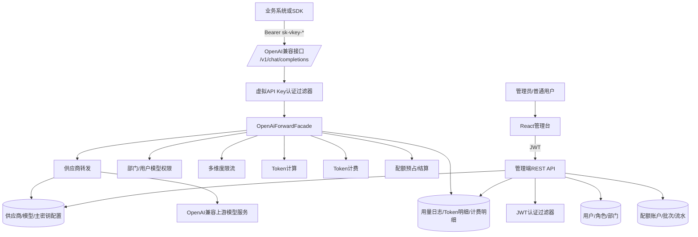
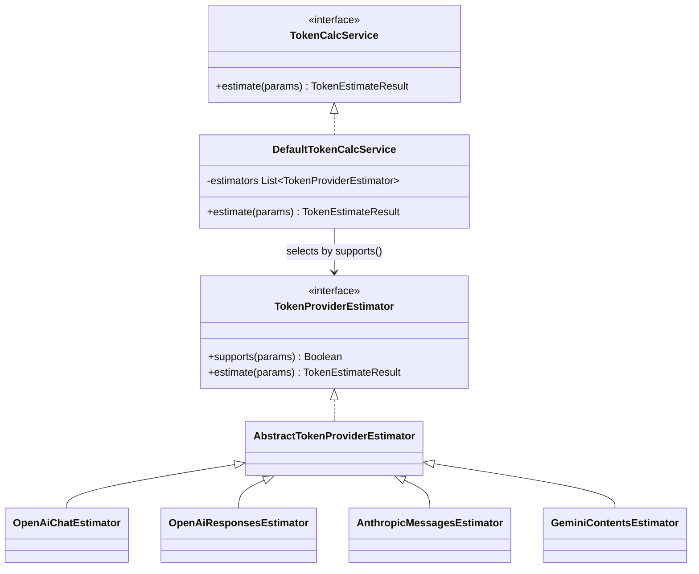
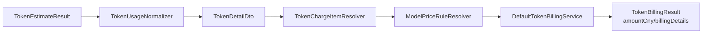
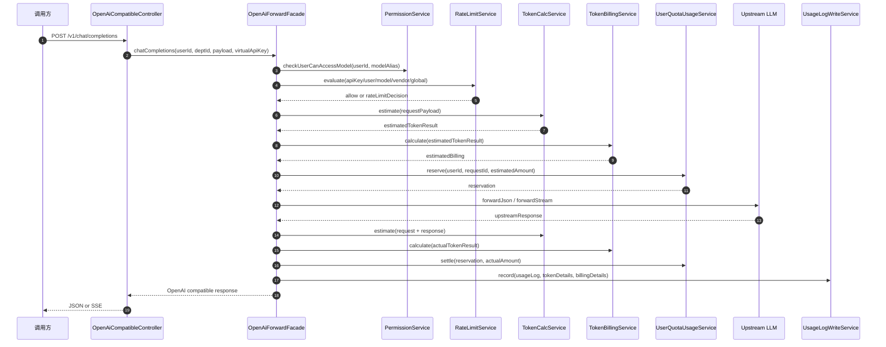
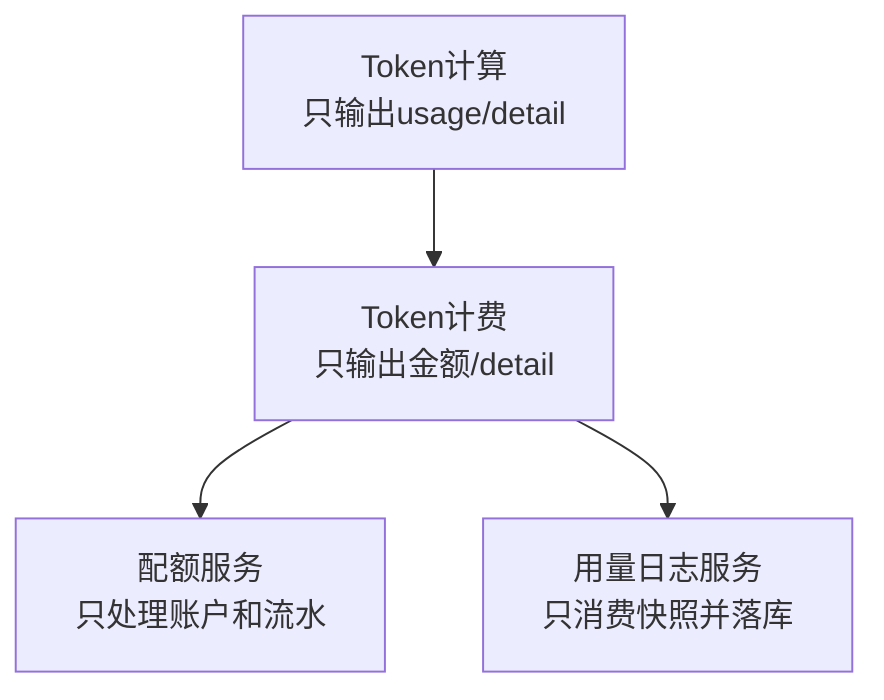
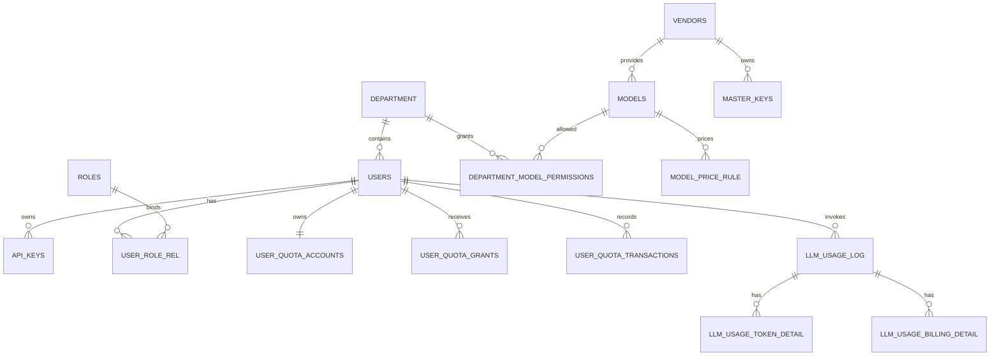
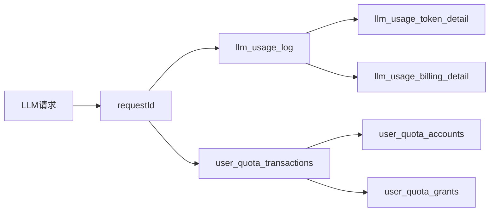

# LLM-Gateway

LLM-Gateway 是一个面向组织内部使用的多供应商大模型统一接入网关。项目提供 OpenAI 兼容调用入口、供应商与模型映射、部门模型权限、虚拟 API Key、Token 计算、Token 计费、用户配额扣减和使用统计能力，并配套 React 管理后台。

## 项目结构

```text
.
├── llm-gateway                 # Spring Boot + Kotlin 后端服务
│   ├── controller              # OpenAI兼容接口、认证接口、管理端接口
│   ├── service                 # 业务编排：转发、权限、配额、统计、模型管理
│   ├── tokencalc               # Token计算策略与协议适配
│   ├── billing                 # Token计费规则解析与金额计算
│   ├── ratelimit               # Redis/Redisson多维度限流
│   ├── security                # JWT与虚拟API Key认证过滤器
│   └── dal                     # MyBatis Dynamic SQL Mapper与数据模型
└── llm-gateway-ui              # Vite + React + Ant Design 管理台
```

## 技术栈

| 层级 | 技术实现 |
| --- | --- |
| 后端框架 | Spring Boot 2.3.4、Spring MVC、Spring Security、Spring WebFlux WebClient |
| 开发语言 | Kotlin 1.9、Java 8 |
| 数据访问 | MyBatis Dynamic SQL、MyBatis Generator、PageHelper |
| 存储组件 | MySQL、Redis/Redisson |
| 安全认证 | JWT、BCrypt、虚拟 API Key SHA-256 摘要存储、主密钥 AES-GCM 加密 |
| 接口文档 | Springfox Swagger2 |
| 前端 | React 18、TypeScript、Vite、Ant Design、Axios |
| 测试脚本 | Shell 与 Python HTTP 回归脚本 |

## 系统架构



## 核心功能

### LLM 支持

- 对外暴露 `POST /v1/chat/completions`，请求格式兼容 OpenAI Chat Completions。
- 支持非流式 JSON 响应和 `stream=true` 的 SSE 流式响应。
- 通过模型别名屏蔽上游真实模型名，调用方只感知平台配置的 `modelAlias`。
- 上游供应商通过 `vendors.base_url`、`models.real_model_name`、`master_keys` 组合完成路由。
- 主密钥按供应商管理，密文使用 AES-GCM 解密后再请求上游。

### 组织架构管理

- 支持部门树管理，包括一级部门、子部门和删除校验。
- 支持用户、角色、用户角色关系维护。
- 用户归属部门后，通过部门模型权限获得可调用模型集合。
- 部门权限支持直接权限和生效权限视图，适用于组织层级继承场景。

### 供应商与模型权限配置

- 供应商管理：维护供应商名称、基础地址和状态。
- 模型映射：维护对内模型别名、上游真实模型名、供应商归属和启停状态。
- 主密钥管理：按供应商配置多个上游 API Key，并按权重选择可用密钥。
- 价格规则管理：按模型维护输入、输出、缓存、推理等不同计费项价格。
- 权限控制：调用前执行 `checkUserCanAccessModel(userId, modelAlias)`，避免越权访问模型。

### Token 计算

Token 计算层只负责生成可审计的 `usage` 和 `tokenDetails`，不参与计费、配额和落库。



当前 Token 协议模型包括：

- `OPENAI_CHAT`
- `OPENAI_RESPONSES`
- `ANTHROPIC_MESSAGES`
- `GEMINI_CONTENTS`

Token 明细按方向、类型、缓存命中情况拆分，便于后续计费和审计：

- 方向：`INPUT`、`OUTPUT`
- 类型：文本、图片、音频、推理、工具调用、预测输出等
- 缓存：`CACHE_HIT`、`CACHE_MISS`、`CACHE_WRITE`、`NONE`

### Token 计费

计费层基于 Token 明细逐项计费，不重新解析请求和响应。



计费规则按百万 Token 单价计算，金额统一保留到 8 位小数。若精细计费项未配置价格，会按兼容规则回退到基础输入或输出价格；仍无法匹配时按 0 元计费并输出告警日志。

### 用户配额

配额体系由账户、额度批次和流水组成：

- `user_quota_accounts`：用户当前可用额度、总额度、已用额度、最早过期时间。
- `user_quota_grants`：额度批次，支持管理员发放、用户转配、过期和耗尽状态。
- `user_quota_transactions`：额度变动流水，记录发放、回收、转入、转出、预占、结算、退款。

LLM 请求在转发前按预估金额执行额度预占；上游响应成功后按实际 Token 金额结算，多退少补；上游失败时退回预占额度。

## 核心调用链路



## 设计模式与工程实现

### 策略模式：Token 协议估算器

`DefaultTokenCalcService` 注入 `List<TokenProviderEstimator>`，运行时根据 `supports(params)` 选择具体估算器。新增协议时只需要新增估算器实现，不需要改动调用方。

### Facade 编排：OpenAiForwardFacade

`OpenAiForwardFacade` 负责把权限校验、限流、Token 预估、金额预估、配额预占、上游转发、实际结算和日志记录串成一个完整事务链路。`OpenAiForwardService` 只处理模型路由、主密钥解密和上游 HTTP 调用，边界清晰。

### 责任分离：计算、计费、落库解耦



这种拆分保证 Token 计算规则、价格规则、配额扣减和日志审计可以独立演进。

### 多维度限流

网关使用 Redisson 对以下维度依次限流：

- 虚拟 API Key
- 用户
- 模型
- 供应商
- 全局

命中限流时返回 OpenAI 风格错误响应，并带上 `Retry-After`、`X-RateLimit-*` 等响应头。

## 数据域说明



## 管理台能力

前端位于 `llm-gateway-ui`，主要页面包括：

- 登录
- 用户管理、角色管理、部门管理
- 供应商管理、模型管理、主密钥管理
- 虚拟密钥管理
- 配额仪表盘、配额流水
- 用量统计、用户维度/部门维度统计

Axios 统一处理 JWT 注入，并在 401/403 时清理本地登录态。

## 接口概览

| 模块 | 主要接口 |
| --- | --- |
| 认证 | `POST /api/auth/login` |
| OpenAI兼容调用 | `POST /v1/chat/completions` |
| 用户虚拟密钥 | `POST /admin/user/keys`、`GET /admin/user/keys`、`DELETE /admin/user/keys/{id}` |
| 用户配额 | `GET /admin/user/quotas/current`、`GET /admin/user/quotas/transactions`、`POST /admin/user/quotas/transfer` |
| 用户用量 | `GET /admin/user/usage/logs`、`GET /admin/user/usage/models/usage-counts`、`GET /admin/user/usage/recent-month-hourly-heatmap` |
| 管理端用户权限 | `POST /admin/users`、`GET /admin/users`、`PUT /admin/departments/{id}/permissions` |
| 模型接入 | `POST /admin/vendors`、`POST /admin/models`、`POST /admin/master-keys`、`POST /admin/model-price-rules` |
| 统计分析 | `GET /admin/statistics/usage/logs`、`GET /admin/statistics/usage/departments`、`GET /admin/statistics/usage/users` |

Swagger 地址：

```text
http://localhost:8080/swagger-ui.html
```

## 本地启动

### 后端

后端默认读取 `application-dev.yaml`，需要本地准备 MySQL 与 Redis。

```bash
cd llm-gateway
mvn spring-boot:run
```

默认端口：

```text
http://localhost:8080
```

初始化后登录账号密码：

```text
admin
123456
```

关键配置：

```yaml
spring:
  datasource:
    url: jdbc:mysql://127.0.0.1:3306/llm-gateway
  redis:
    host: 127.0.0.1

gateway:
  aes-secret: 2026-advanceWithAI-LLMGateway-QY-DEV
  forward-timeout-seconds: 65
  rate-limit:
    redisson:
      enabled: true
```

### 前端

```bash
cd llm-gateway-ui
npm install
npm run dev
```

构建：

```bash
npm run build
```

## 一次请求的关键数据沉淀



通过 `requestId` 可以关联一次调用的请求状态、Token 计算来源、计费明细、配额预占/结算流水和最终账户余额。
